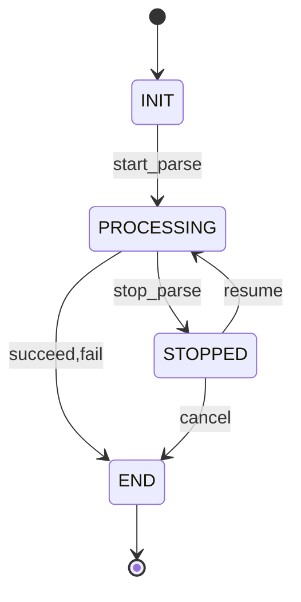
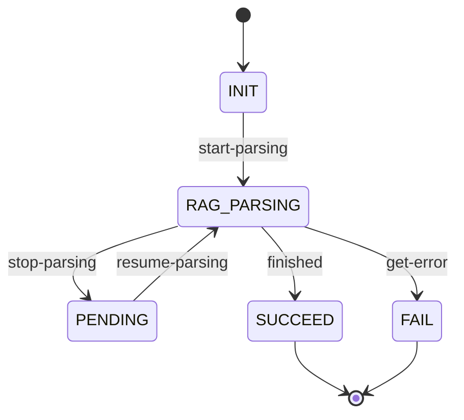

## Document Statemachine



```mermaid
stateDiagram-v2
[*] --> INIT
INIT --> PROCESSING: start_parse
PROCESSING-->STOPPED: stop_parse
STOPPED-->PROCESSING: resume
PROCESSING-->END: succeed,fail
STOPPED-->END: cancel
END --> [*]
```

## RAG Data Parsing Task Statemachine


```mermaid
stateDiagram-v2
[*] --> INIT
INIT --> RAG_PARSING: start-parsing
RAG_PARSING-->PENDING: stop-parsing
PENDING-->RAG_PARSING: resume-parsing
RAG_PARSING-->FAIL: get-error
RAG_PARSING-->SUCCEED: finished
SUCCEED --> [*]
FAIL --> [*]


```


```mermaid

```
